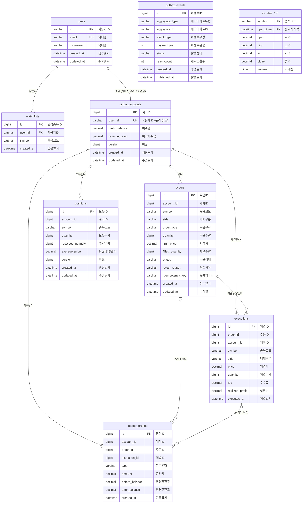

# 논리 데이터 모델 (ERD)

> 2026-09-22 기준. Phase 6까지 **실제로 적용된 마이그레이션**을 옮긴 것이다.
> 원본은 각 서비스의 `src/main/resources/db/migration/*.sql` 이고, 이 문서와 어긋나면 SQL이 맞다.

엔티티명과 속성명은 **한글(논리명)** 이다. 실제 테이블·컬럼명은 각 표의 `물리명` 열에 있다.

## 1. 전체 구조

데이터베이스가 **서비스마다 하나씩, 셋**이다. 서비스끼리 남의 DB를 직접 읽지 않는다.

| 데이터베이스 | 서비스 | 엔티티 |
|---|---|---|
| `wts_user` | user-service | 사용자, 관심종목 |
| `wts_trading` | trading-service | 가상계좌, 주문, 보유종목, 체결, 원장기록, 발행대기이벤트 |
| `wts_market` | market-service | 1분봉 |

```
┌─ wts_user ─────────────────┐   ┌─ wts_market ──────────┐
│                            │   │                       │
│   사용자 ──1:N── 관심종목   │   │        1분봉          │
│     │                      │   │                       │
└─────│──────────────────────┘   └───────────────────────┘
      │
      │ 논리 참조 (FK 없음 · 서비스 경계)
      │
┌─────│─── wts_trading ───────────────────────────────────┐
│     ▼                                                   │
│  가상계좌 ──1:N── 주문 ──1:N── 체결                       │
│     │                            │                      │
│     ├──1:N── 보유종목            │                      │
│     │                            │                      │
│     └──1:N── 원장기록 ◀──────────┘                      │
│                                                         │
│  발행대기이벤트  (독립 · 애그리거트를 문자열로만 참조)     │
└─────────────────────────────────────────────────────────┘
```

### Mermaid

GitLab · GitHub · https://mermaid.live 에서 렌더링된다.

> Mermaid는 속성명에 한글을 받지 못한다(식별자가 영문·숫자로 제한된다).
> 아래 도식은 **관계 구조**를 보는 용도이고, 속성명까지 한글인 ERD는
> [erd.dbml](erd.dbml)을 https://dbdiagram.io 에 붙여넣으면 나온다.



### ERD 그리기

| 도구 | 입력 | 결과 |
|---|---|---|
| **dbdiagram.io** | [erd.dbml](erd.dbml) 붙여넣기 | **엔티티·속성명이 전부 한글**인 ERD. PNG/PDF/SVG |
| mermaid.live | 위 mermaid 블록 | 관계 구조 도식. PNG/SVG |
| GitLab / GitHub | 이 파일 그대로 | mermaid 블록이 자동 렌더링 |

DBeaver·MySQL Workbench 역공학은 권하지 않는다. 실제 DB 외래키가 하나뿐이라
**관계선이 거의 그려지지 않는다** (3절 참고).

---

## 2. 엔티티 상세

표기: **PK** 기본키 · **UK** 유일키 · **FK** 외래키 · ● 필수 · ○ 선택

### 2.1 사용자 `users` — `wts_user`

| 한글명 | 물리명 | 타입 | 필수 | 키 | 설명 |
|---|---|---|---|---|---|
| 사용자ID | `id` | VARCHAR(36) | ● | PK | UUID. 서비스 경계를 넘나들어 전역 유일해야 한다 |
| 이메일 | `email` | VARCHAR(255) | ● | UK | 소문자로 정규화해 저장 |
| 닉네임 | `nickname` | VARCHAR(50) | ● | | 비우고 로그인하면 이메일 앞부분을 쓴다 |
| 생성일시 | `created_at` | DATETIME(6) | ● | | UTC |
| 수정일시 | `updated_at` | DATETIME(6) | ● | | UTC |

이메일 유일키는 Mock Login이 같은 이메일로 재로그인할 때 기존 사용자를 돌려주기 위한 것이다.
동시 요청으로 중복 생성되는 것을 DB에서 막는다.

### 2.2 관심종목 `watchlists` — `wts_user`

| 한글명 | 물리명 | 타입 | 필수 | 키 | 설명 |
|---|---|---|---|---|---|
| 관심종목ID | `id` | BIGINT | ● | PK | 자동 증가 |
| 사용자ID | `user_id` | VARCHAR(36) | ● | FK, UK | → 사용자.사용자ID |
| 종목코드 | `symbol` | VARCHAR(20) | ● | UK | 6자리 숫자. 종목 마스터는 DB에 없다 (§6절) |
| 담은일시 | `created_at` | DATETIME(6) | ● | | UTC |

- 유일키 `(사용자ID, 종목코드)` — 같은 종목을 두 번 담을 수 없다. 중복 추가 요청을 이 제약이 막는다.
- **이 프로젝트에서 유일하게 DB 외래키가 걸린 관계다.** 사용자와 같은 스키마에 있어서
  가능하다. 사용자가 지워지면 관심종목도 함께 지워진다 (`ON DELETE CASCADE`).

### 2.3 가상계좌 `virtual_accounts` — `wts_trading`

| 한글명 | 물리명 | 타입 | 필수 | 키 | 설명 |
|---|---|---|---|---|---|
| 계좌ID | `id` | BIGINT | ● | PK | 자동 증가 |
| 사용자ID | `user_id` | VARCHAR(36) | ● | UK | → 사용자.사용자ID (**FK 없음**, 다른 DB) |
| 예수금 | `cash_balance` | DECIMAL(19,4) | ● | | 예약금은 여기서 빠지지 않는다 |
| 예약예수금 | `reserved_cash` | DECIMAL(19,4) | ● | | 미체결 매수 주문이 묶어둔 금액 |
| 낙관적락 버전 | `version` | BIGINT | ● | | JPA `@Version` |
| 개설일시 | `created_at` | DATETIME(6) | ● | | UTC |
| 수정일시 | `updated_at` | DATETIME(6) | ● | | UTC |

- 사용자당 계좌 하나다 (`UNIQUE(user_id)`). `GET /api/trading/account` 가 계좌번호 없이
  조회하는 것도 이 전제다.
- **주문가능금액 = 예수금 − 예약예수금** (파생값, 저장하지 않는다)
- 무결성 제약 세 가지
  - 예수금 ≥ 0 — "예수금은 음수가 될 수 없다"
  - 예약예수금 ≥ 0
  - 예약예수금 ≤ 예수금

### 2.4 주문 `orders` — `wts_trading`

| 한글명 | 물리명 | 타입 | 필수 | 키 | 설명 |
|---|---|---|---|---|---|
| 주문ID | `id` | BIGINT | ● | PK | 자동 증가 |
| 계좌ID | `account_id` | BIGINT | ● | UK | → 가상계좌.계좌ID (FK 없음) |
| 종목코드 | `symbol` | VARCHAR(20) | ● | | |
| 매매구분 | `side` | VARCHAR(4) | ● | | `BUY` 매수 / `SELL` 매도 |
| 주문유형 | `order_type` | VARCHAR(8) | ● | | `MARKET` 시장가 / `LIMIT` 지정가 |
| 주문수량 | `quantity` | BIGINT | ● | | |
| 지정가 | `limit_price` | DECIMAL(19,4) | ○ | | 지정가 주문에만 있다 |
| 체결수량 | `filled_quantity` | BIGINT | ● | | 기본 0 |
| 주문상태 | `status` | VARCHAR(16) | ● | | 아래 상태 전이 참고 |
| 거절사유 | `reject_reason` | VARCHAR(40) | ○ | | 거절된 주문에만. 에러코드 이름 |
| 중복방지키 | `idempotency_key` | VARCHAR(64) | ● | UK | 클라이언트가 만든 UUID |
| 접수일시 | `created_at` | DATETIME(6) | ● | | UTC |
| 수정일시 | `updated_at` | DATETIME(6) | ● | | UTC |

**주문상태 전이**

```
접수(RECEIVED) ──검증──> 검증완료(VALIDATED) ──수락──> 미체결(ACCEPTED) ──체결──> 체결완료(FILLED)
      │                                                    │
      └──거절──> 거절(REJECTED)                            └──취소──> 취소(CANCELLED)
```

`RECEIVED`와 `VALIDATED`는 접수 트랜잭션 안에서만 스쳐 간다. **저장된 주문은 언제나
`ACCEPTED` / `FILLED` / `CANCELLED` / `REJECTED` 넷 중 하나다.**

- 유일키 `(계좌ID, 중복방지키)` — 같은 계좌에서 같은 키로 두 번 주문할 수 없다.
- 무결성 제약
  - 주문수량 > 0
  - 0 ≤ 체결수량 ≤ 주문수량
  - 지정가는 NULL이거나 0보다 크다
  - 주문유형이 `LIMIT`이면 지정가가 반드시 있다

### 2.5 보유종목 `positions` — `wts_trading`

| 한글명 | 물리명 | 타입 | 필수 | 키 | 설명 |
|---|---|---|---|---|---|
| 보유ID | `id` | BIGINT | ● | PK | 자동 증가 |
| 계좌ID | `account_id` | BIGINT | ● | UK | → 가상계좌.계좌ID (FK 없음) |
| 종목코드 | `symbol` | VARCHAR(20) | ● | UK | |
| 보유수량 | `quantity` | BIGINT | ● | | 기본 0 |
| 예약수량 | `reserved_quantity` | BIGINT | ● | | 미체결 매도 주문이 묶어둔 수량 |
| 평균매입단가 | `average_price` | DECIMAL(19,4) | ● | | 이동평균. 매도는 이 값을 바꾸지 않는다 |
| 낙관적락 버전 | `version` | BIGINT | ● | | JPA `@Version` |
| 생성일시 | `created_at` | DATETIME(6) | ● | | UTC |
| 수정일시 | `updated_at` | DATETIME(6) | ● | | UTC |

- 유일키 `(계좌ID, 종목코드)` — 한 계좌에 한 종목은 한 줄이다.
- **매도가능수량 = 보유수량 − 예약수량** (파생값)
- 전량 매도해도 행은 남는다. 보유수량 0, 평균매입단가 0이 되고 조회에서 제외된다.
- 무결성 제약: 보유수량 ≥ 0, 예약수량 ≥ 0, 예약수량 ≤ 보유수량, 평균매입단가 ≥ 0

### 2.6 체결 `executions` — `wts_trading`

| 한글명 | 물리명 | 타입 | 필수 | 키 | 설명 |
|---|---|---|---|---|---|
| 체결ID | `id` | BIGINT | ● | PK | 자동 증가 |
| 주문ID | `order_id` | BIGINT | ● | | → 주문.주문ID (FK 없음) |
| 계좌ID | `account_id` | BIGINT | ● | | → 가상계좌.계좌ID. 조회 편의를 위한 비정규화 |
| 종목코드 | `symbol` | VARCHAR(20) | ● | | |
| 매매구분 | `side` | VARCHAR(4) | ● | | `BUY` / `SELL` |
| 체결가 | `price` | DECIMAL(19,4) | ● | | **주문에는 없는 값이다. 여기에만 남는다** |
| 체결수량 | `quantity` | BIGINT | ● | | |
| 수수료 | `fee` | DECIMAL(19,4) | ● | | MVP는 0 |
| 실현손익 | `realized_profit` | DECIMAL(19,4) | ○ | | **매도 체결에만.** (체결가 − 체결 시점 평균단가) × 수량 |
| 체결일시 | `executed_at` | DATETIME(6) | ● | | UTC |

- 실현손익을 저장하는 이유: 평균매입단가는 이후 매수로 바뀌므로 **나중에 재계산할 수 없다.**
- 무결성 제약: 체결가 > 0, 체결수량 > 0, 수수료 ≥ 0

### 2.7 원장기록 `ledger_entries` — `wts_trading`

| 한글명 | 물리명 | 타입 | 필수 | 키 | 설명 |
|---|---|---|---|---|---|
| 원장ID | `id` | BIGINT | ● | PK | 자동 증가 |
| 계좌ID | `account_id` | BIGINT | ● | | → 가상계좌.계좌ID (FK 없음) |
| 주문ID | `order_id` | BIGINT | ○ | | 주문에서 비롯된 기록에만 |
| 체결ID | `execution_id` | BIGINT | ○ | | 체결에서 비롯된 기록에만 |
| 기록유형 | `type` | VARCHAR(20) | ● | | 아래 참고 |
| 증감액 | `amount` | DECIMAL(19,4) | ● | | **부호 있는 값.** 입금 양수 / 출금 음수 |
| 변경전잔고 | `before_balance` | DECIMAL(19,4) | ● | | |
| 변경후잔고 | `after_balance` | DECIMAL(19,4) | ● | | |
| 기록일시 | `created_at` | DATETIME(6) | ● | | UTC |

**기록유형**

| 값 | 의미 | 주문ID | 체결ID |
|---|---|---|---|
| `INITIAL_DEPOSIT` | 계좌 개설 시 초기 가상자금 1억원 | ○ | ○ |
| `BUY` | 매수 체결 대금 출금 | ● | ● |
| `SELL` | 매도 체결 대금 입금 | ● | ● |
| `FEE` | 수수료·세금 | ● | ● |
| `ADJUSTMENT` | 운영상 조정 | ○ | ○ |

- **핵심 불변식: 변경후잔고 = 변경전잔고 + 증감액.** DB CHECK로 강제한다.
  이게 지켜져야 원장만으로 잔고를 재구성할 수 있다.
- 그 외 제약: 변경후잔고 ≥ 0, 증감액 ≠ 0 (0원짜리 기록은 남기지 않는다)
- MVP는 수수료율이 0이라 `FEE` 기록이 생기지 않는다.

### 2.8 발행대기이벤트 `outbox_events` — `wts_trading`

| 한글명 | 물리명 | 타입 | 필수 | 키 | 설명 |
|---|---|---|---|---|---|
| 이벤트ID | `id` | BIGINT | ● | PK | 자동 증가 |
| 애그리거트유형 | `aggregate_type` | VARCHAR(30) | ● | | `Order` / `Execution` / `Account` / `Position` / `Ledger` |
| 애그리거트ID | `aggregate_id` | VARCHAR(64) | ● | | Kafka 메시지 키. 같은 애그리거트의 순서를 보장한다 |
| 이벤트유형 | `event_type` | VARCHAR(60) | ● | | Kafka 토픽 이름과 같다 |
| 이벤트본문 | `payload_json` | JSON | ● | | 이벤트 봉투 전체(이벤트 고유ID 포함) |
| 발행상태 | `status` | VARCHAR(12) | ● | | `PENDING` 대기 / `PUBLISHED` 발행완료 / `FAILED` 실패 |
| 재시도횟수 | `retry_count` | INT | ● | | 5회를 넘기면 `FAILED` |
| 생성일시 | `created_at` | DATETIME(6) | ● | | UTC |
| 발행일시 | `published_at` | DATETIME(6) | ○ | | 발행 성공 시각 |

- **다른 엔티티와 관계선을 긋지 않는다.** 애그리거트를 유형+문자열ID로만 가리킨다.
  여러 종류의 애그리거트를 한 테이블이 받아야 해서 외래키를 걸 수 없다.
- 거래 트랜잭션이 주문·계좌 변경과 **같은 커밋**으로 이 행을 남긴다. 별도 발행자가
  Kafka로 옮긴다. DB와 Kafka에 따로 쓰는 문제(Dual Write)를 없애기 위한 구조다.

### 2.9 1분봉 `candles_1m` — `wts_market`

| 한글명 | 물리명 | 타입 | 필수 | 키 | 설명 |
|---|---|---|---|---|---|
| 종목코드 | `symbol` | VARCHAR(20) | ● | PK | 복합 기본키 |
| 봉 시작시각 | `open_time` | DATETIME(6) | ● | PK | 해당 분의 시작 시각. UTC |
| 시가 | `open` | DECIMAL(19,4) | ● | | |
| 고가 | `high` | DECIMAL(19,4) | ● | | |
| 저가 | `low` | DECIMAL(19,4) | ● | | |
| 종가 | `close` | DECIMAL(19,4) | ● | | |
| 거래량 | `volume` | BIGINT | ● | | 해당 분 동안의 거래량 |

- 기본키가 `(종목코드, 봉 시작시각)` 복합키다. 대리키를 두지 않았다.
- 시세 이벤트를 집계해 만든다. 분이 바뀌는 순간 직전 분의 봉이 확정된다.
- 거래량은 누적 거래량의 **차이**로 계산한다. 같은 이벤트를 두 번 받아도 부풀지 않는다.
- 무결성 제약: 고가 ≥ 시가·종가·저가, 저가 ≤ 시가·종가, 거래량 ≥ 0

---

## 3. 관계 정의

| 부모 | 자식 | 카디널리티 | DB 외래키 | 설명 |
|---|---|---|---|---|
| 사용자 | 관심종목 | 1 : N | **있음** (CASCADE) | 같은 DB |
| 사용자 | 가상계좌 | 1 : 1 | 없음 | **DB가 다르다.** `UNIQUE(user_id)`로 1:1을 강제 |
| 가상계좌 | 주문 | 1 : N | 없음 | |
| 가상계좌 | 보유종목 | 1 : N | 없음 | `UNIQUE(계좌ID, 종목코드)` |
| 가상계좌 | 체결 | 1 : N | 없음 | 조회 편의를 위한 비정규화 경로 |
| 가상계좌 | 원장기록 | 1 : N | 없음 | |
| 주문 | 체결 | 1 : N | 없음 | **MVP는 부분체결이 없어 사실상 1 : 0..1** |
| 주문 | 원장기록 | 1 : 0..N | 없음 | 초기 입금 기록에는 주문이 없다 |
| 체결 | 원장기록 | 1 : 0..N | 없음 | 수수료가 있으면 체결 하나에 기록 둘 |

### 외래키가 거의 없는 이유

**서비스 경계를 넘는 관계(사용자 ↔ 가상계좌)는 DB가 달라 외래키를 걸 수 없다.**
마이크로서비스에서 당연한 제약이고, 무결성은 애플리케이션이 지킨다.

**같은 DB 안(가상계좌 ↔ 주문/보유종목/체결/원장기록)에도 외래키를 걸지 않았다.**
장점은 대량 쓰기 경로가 가벼워지는 것이고, 대가는 참조 무결성을 애플리케이션에만
의존하게 되는 것이다. 지금은 계좌를 지우는 기능이 없어 고아 행이 생길 경로가 없지만,
**계좌 삭제나 데이터 정리 기능이 생기면 이 결정을 다시 봐야 한다.**

---

## 4. 파생값 (저장하지 않는 것)

| 값 | 계산식 | 노출 위치 |
|---|---|---|
| 주문가능금액 | 예수금 − 예약예수금 | 계좌 조회 |
| 매도가능수량 | 보유수량 − 예약수량 | 보유종목 조회 |
| 미체결수량 | 주문수량 − 체결수량 | 주문 조회 |
| 체결금액 | 체결가 × 체결수량 | 체결 조회 |
| 매입금액 | 평균매입단가 × 보유수량 | 포트폴리오 |
| 평가금액 | 현재가 × 보유수량 | 포트폴리오 |
| 평가손익 | 평가금액 − 매입금액 | 포트폴리오 |
| 누적 실현손익 | Σ 체결.실현손익 | 포트폴리오 |
| 총자산 | 예수금 + 평가금액 | 포트폴리오 |

---

## 5. 데이터 타입 규칙

| 구분 | 타입 | 이유 |
|---|---|---|
| 금액 | `DECIMAL(19,4)` | 금융 계산에 부동소수를 쓰지 않는다 |
| 수량 | `BIGINT` | 주식 수량은 정수다 |
| 시각 | `DATETIME(6)` | **전부 UTC로 저장**한다. 화면에서 `Asia/Seoul`로 바꾼다 |
| 사용자ID | `VARCHAR(36)` | UUID. 서비스 경계를 넘나든다 |
| 그 외 ID | `BIGINT AUTO_INCREMENT` | 한 서비스 안에서만 쓰인다 |
| 열거값 | `VARCHAR` | DB `ENUM`을 쓰지 않는다. 값을 추가할 때 스키마 변경이 필요해진다 |

---

## 6. 스키마에 없는 데이터

ERD에 없지만 시스템이 쓰는 데이터다. **DB에 넣지 않은 이유가 각각 있다.**

| 데이터 | 저장 위치 | 이유 |
|---|---|---|
| **종목 마스터** (종목코드, 종목명, 시장) | market-service 설정 파일 | MVP는 고정 5종목이다. 종목이 늘면 테이블로 옮긴다 |
| **최신 현재가 / 호가** | Valkey (`market:price:*`, `market:orderbook:*`) | 재생성 가능한 실시간 캐시다. 원본은 시세 공급자에 있다 |
| **가상 계좌 원본 / 주문 / 체결 / 원장** | MySQL | Valkey에 넣지 않는다. 이 데이터의 원본은 MySQL이다 |

종목코드(`symbol`)는 관심종목·주문·보유종목·체결·1분봉 다섯 곳에 나오지만
**참조할 부모 테이블이 없다.** 종목 마스터가 DB 밖에 있기 때문이다.
형식(6자리 숫자)만 애플리케이션이 검증한다.

---

## 7. 아직 없는 테이블

설계 문서(CLAUDE.md §23)에 있으나 만들지 않은 것.

| 테이블 | 판단 |
|---|---|
| `processed_events` | 이벤트 중복 처리 방지용. 유일한 소비자가 **주문 상태 머신**으로 이미 보호된다. 이미 체결된 주문은 다시 체결되지 않으므로 별도 표가 필요 없다 |

---

## 8. 참고

| 문서 | 내용 |
|---|---|
| [phase3-trading.md](phase3-trading.md) | 주문 흐름 · 상태 머신 · 예약 · 동시성 |
| [phase4-execution-ledger.md](phase4-execution-ledger.md) | 체결 정산 · 원장 · Outbox |
| [ADR-0009](../decisions/0009-pessimistic-lock-on-account.md) | 계좌 행 비관적 락으로 주문 직렬화 |
| [ADR-0010](../decisions/0010-outbox-over-direct-publish.md) | Outbox를 쓰는 이유 |
| [ADR-0011](../decisions/0011-no-processed-events-table.md) | `processed_events`를 만들지 않은 이유 |
